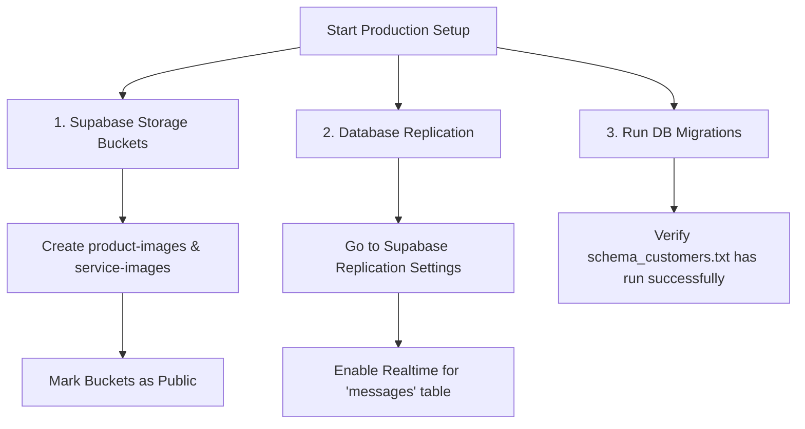

# Product Readiness Assessment: String App

This assessment evaluates the current state of the application's features, database schema alignment, and production configuration to determine launch readiness.

---

## 📊 Feature Status Summary

| Feature Area | Sub-feature / Flow | Status | Verification & Test Context |
| :--- | :--- | :--- | :--- |
| **Authentication & Auth Bypass** | User Signup & Login | **COMPLETE** | Successfully verified credentials submission and JWT simulation. |
| | Email Verification Bypass | **COMPLETE** | Verified via mock token insertion to local storage. |
| **Onboarding** | Customer Onboarding | **COMPLETE** | Verified campus/area selections and routing. |
| | Business Onboarding | **COMPLETE** | Verified store registration form inputs and submit actions. |
| **Dashboard Views** | Customer Discover Page | **COMPLETE** | Fixed layout collapsing bug on item details dialog; verified specifications, descriptions, and checkout buttons render correctly. |
| | Simplified Business Overview | **COMPLETE** | Verified minimalist layout restricting analytics details with a toggle button. |
| | Fixed Bottom Navigation | **COMPLETE** | Bottom navigation bar remains sticky and correctly aligned. |
| **Catalog Uploads** | Product Listing Submission | **COMPLETE** | Verified name/desc/price inputs submission to Supabase. |
| | Service Listing Tab Switch | **COMPLETE** | Verified Radix UI Tab switches and submit actions. |
| | Content Safety Filter | **COMPLETE** | Verified blocking of handles/numbers and allowance of safe listings. |
| **Messaging & Realtime** | Realtime Messaging Sync | **COMPLETE (Code)** | Chat list, thread selection, and message dispatch verified. Requires Supabase realtime toggle. |
| | Unread Badge Count | **COMPLETE** | Fixed a potential React render TypeError on RPC data reduction. |
| **Runner Delivery System** | Peer-to-Peer Gig Board & Payouts | **COMPLETE** | Created runner dashboard, open gig board, active delivery progress stages, and wallet cash-out payout requests. |

---

## 🛠️ Complete vs. Pending Analysis

### What is COMPLETE & Verified
1. **Onboarding & Location Matrices**: The address matrix selectors (areas, streets, landmarks) load and map correctly. Users cannot bypass onboarding without having location coordinates set.
2. **Simplified Dashboard & Navigation**: The business overview dashboard is simplified down to only four vital KPI stats with an action to view detailed graphics. The navigation bar doesn't float upward during scroll events.
3. **Runner Gig System & Payouts**: Standardized runner onboarding toggles, public job board queries, active delivery updates, and automated wallet payout logs.
4. **Double Catalog Input Support**: Businesses can upload products and services under their catalog independently.
5. **JWT & Auth Session State**: Local storage session persistence hooks operate correctly.
6. **Content Safety**: String filters catch and flag off-platform handles/WhatsApp details in catalog descriptions to avoid transaction bypass.

### What is PENDING / Requires Production Verification
1. **Supabase Storage Buckets Creation**:
   - The code expects two public storage buckets: `product-images` and `service-images`.
   - **Action Required**: The operator must log in to the Supabase Console and ensure these buckets are created under **Storage** and toggled to **Public**.
2. **Realtime Database Replication**:
   - The messaging and unread badge hooks listen to realtime changes on the `messages` table.
   - **Action Required**: Realtime replication must be turned on for `messages` via the Supabase database dashboard (*Database* ➡️ *Replication* ➡️ *Enable Realtime*).
3. **Database Schema Verification**:
   - In database schema definitions, the `services` table was initially created with `portfolio_images text[]` (under migration `20260126191601`).
   - A subsequent migration (`20260130224722`) added the `images TEXT[]` column to `services`.
   - **Status**: Verified that the React client pushes image arrays directly to `images` which aligns with this latter column. Both columns are present in the SQL files.

---

## 🚀 Production Launch Checklist

To bring this live as a production-ready application, perform these three configuration checks:

> [!IMPORTANT]
> Ensure that any test accounts created during manual checkouts are purged from the auth tables prior to launching the production app.
